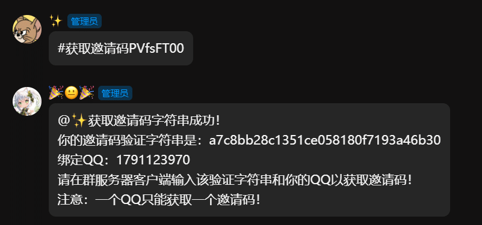
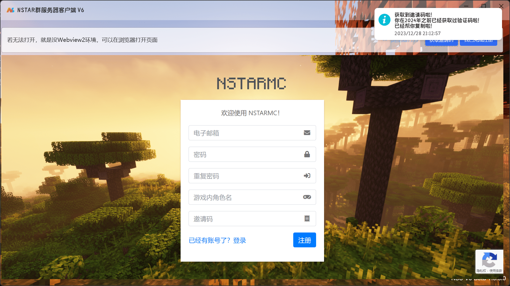

# 加入服务器

## 1.下载群服务器客户端

NSTARMC群服务器有私人开发的群服务器客户端，用于支持MC客户端的登录与更新。

请在群文件/频道中下载客户端。（如果你的电脑已经有第六代客户端，那么你不需要重新安装！）

下载完成后，打开安装包进行安装即可，不多赘述。

## 2.运行群服务器客户端

打开您安装的NSTARMC群服务器客户端第6代。

> [!warning]
> 如果你打不开，可能是由于你没有安装.NET Core6运行环境，你需要自行下载安装。
>
> [https://dotnet.microsoft.com/zh-cn/download/dotnet/6.0](https://dotnet.microsoft.com/zh-cn/download/dotnet/6.0)

然后，会弹出登陆界面。如果您拥有NSTARMC Auth账户，您可以直接登录，若没有，请看第三步“注册登录”

## 3.注册NSTARMC Auth

点击注册，我已阅读须知，进入注册页面。

首先，你需要获取邀请码（Free），点击右上角的“获取邀请码”按钮，会进入邀请码申请界面。

> [!important]
> 没得到邀请码前不要关闭这个彩色的获取邀请码窗口！

点击“复制ID”按钮，软件会自动复制获取邀请码的指令，请张贴在NSTARMC任意一个QQ群中发出（频道不可以）。

> [!tip]
> 您无需担心验证字符串发在群中会导致他人盗用您的邀请码，也无需撤回。验证手段采用双向加密验证，除了管理团队，没有人可以查询到你的邀请码是多少。

然后，复制邀请码验证码，粘贴在群服务器客户端的界面。然后填写好你的QQ号码。

然后点击“获取邀请码”按钮，客户端将自动为你获取邀请码并复制，你只需要粘贴即可！

然后，填写其他信息注册即可！

> [!important]
> 注意：您必须使用QQ数字邮箱进行注册，如：我的qq是1791123970，那么必须使用邮箱1791123970@qq.com进行注册。另外，游戏角色名必须是英文！

注册完成后，去邮箱查收验证邮件，然后点击右上角的“我已完成注册”，进入登陆界面。