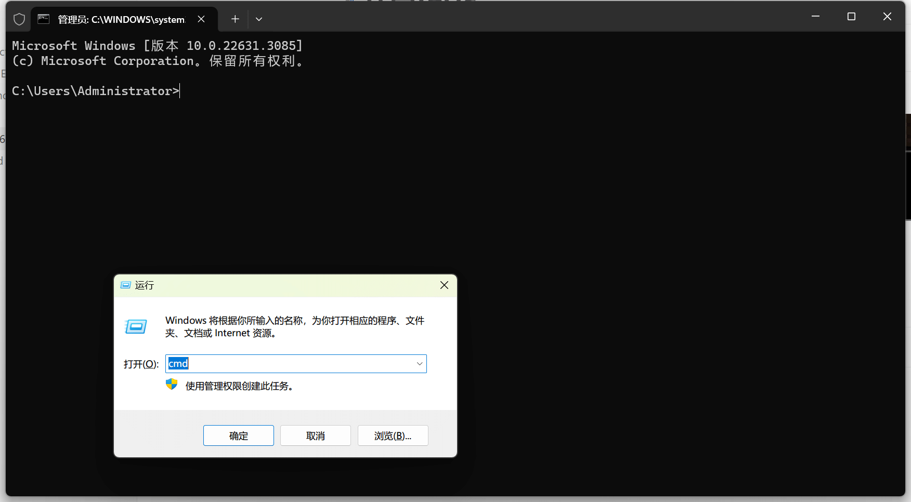
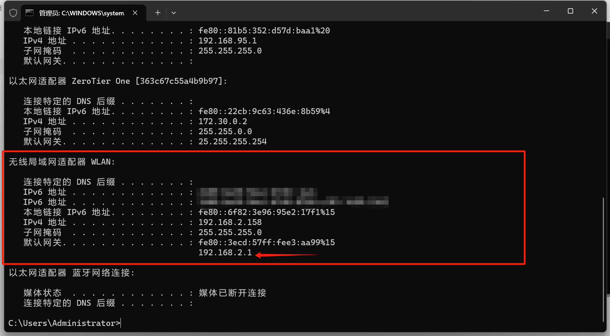
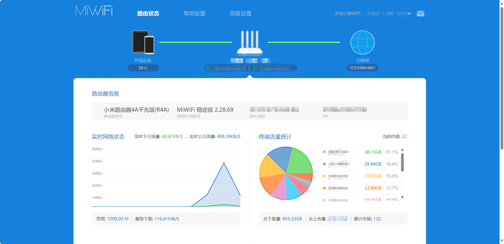
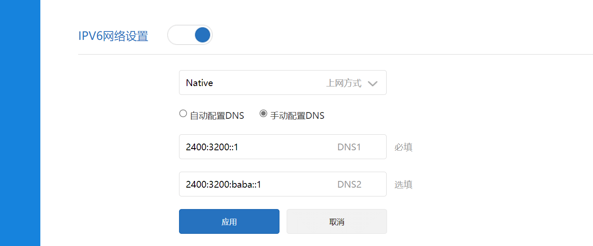

# 📡开启IPV6

# 1.我有IPV6嘛？

服务器的第一个节点能进去的话就用第一个

因为IPV6是直连，延迟更低！

所以推荐使用IPV6节点连接服务器！

# 2.如何开启IPV6？

## 1.登入路由器后台

按Windows徽标键+R，输入CMD，然后回车

然后在cmd（黑色窗口）输入ipconfig，然后找到网关地址（即为路由器后台地址）

浏览器输入这个地址，然后输入密码，登录路由器后台

## 2.尝试开启IPV6

找到ipv6设置（到处找一下那些网络设置）

（如果找不到可以咨询路由器电商客服查询是否支持）

然后开启即可

