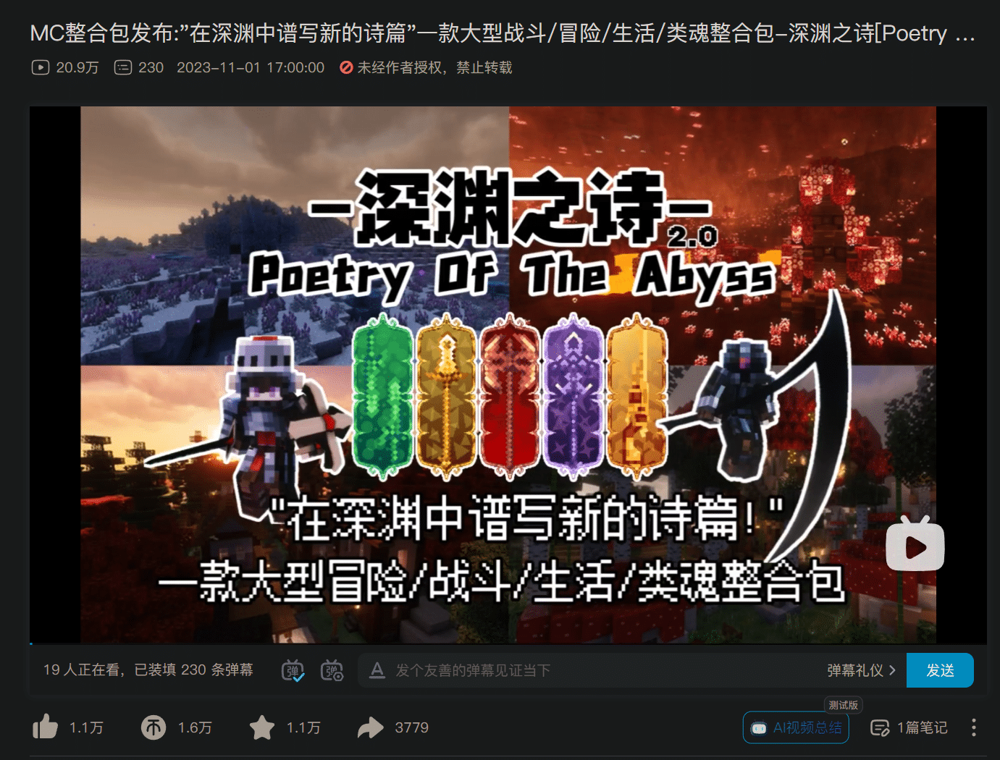
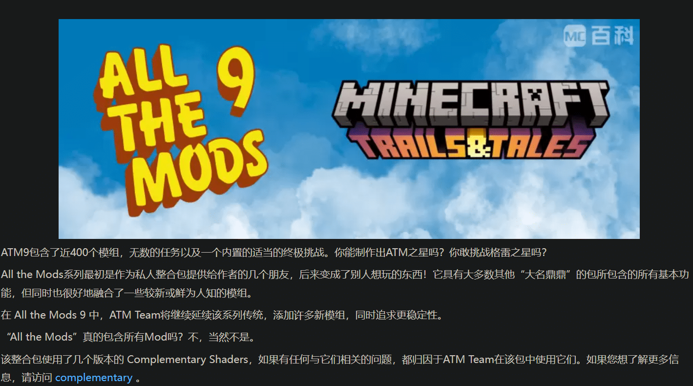
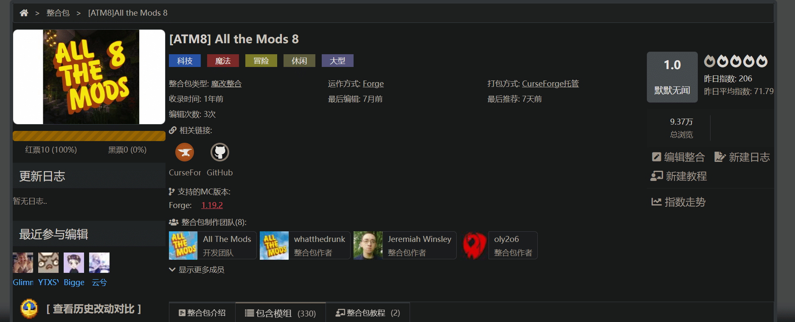
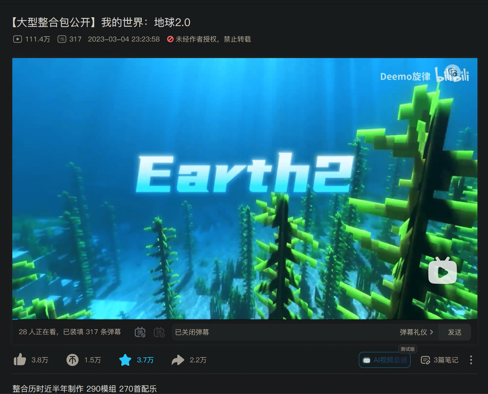
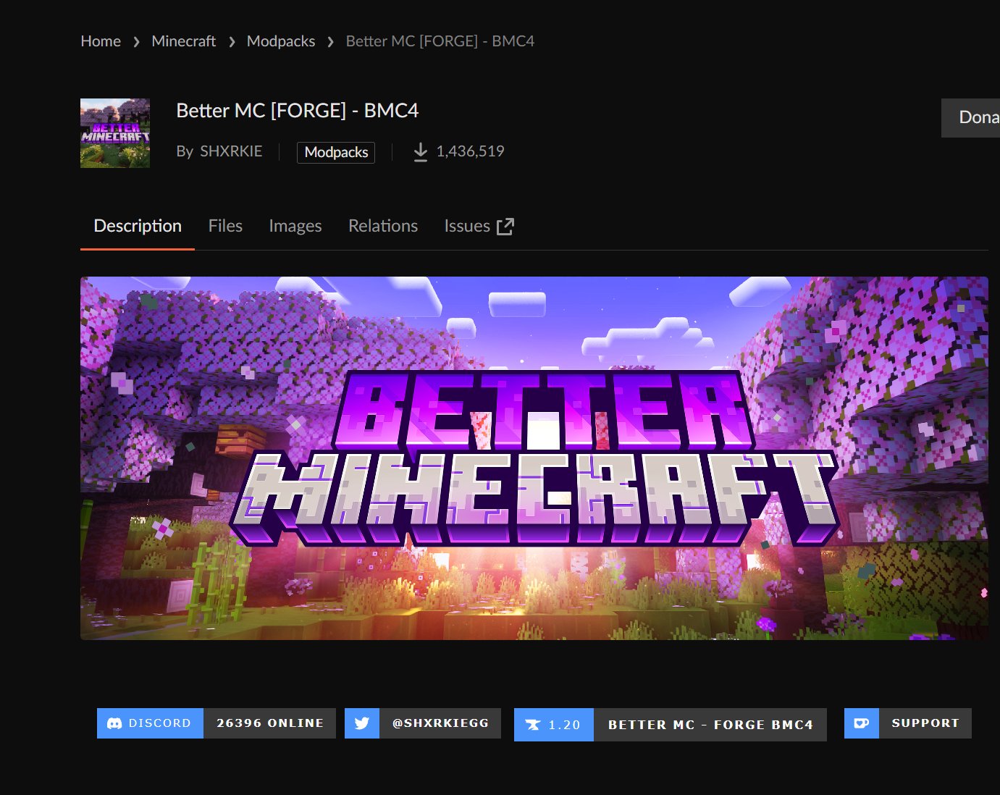
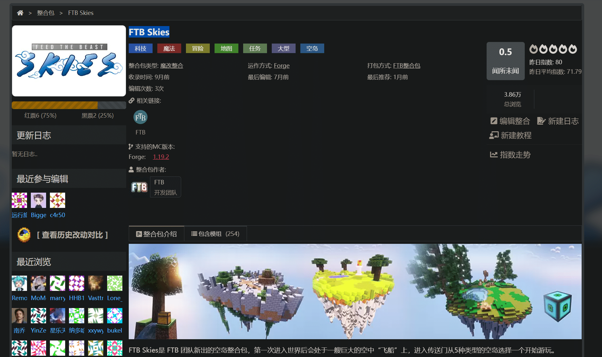

# 🗳️2024寒假档期服务器 投票

# 须知

以下是提供的选择，请在群内的群待办的小程序中选择你想要玩的。

如有特殊要求，请在投票小程序中备注哦~

Bing直接能搜到的整合包我就不贴链接了。

如果你想补充整合包，你可以群里@我。

<u>**最好的补充方式是：提交PR，按照我的格式来写markdown即可！（Github仓库链接在左上角导航栏和文末都有）**</u>

# 投票选项

## 1.原版-1.20.4

这没啥好介绍的吧：）

## 2.整合包：在深渊中谱写新的诗篇

版本：1.18.2

一款大型战斗/冒险/生活/类魂整合包-深渊之诗

介绍视频：[https://www.bilibili.com/video/BV1Dc411R731/](https://www.bilibili.com/video/BV1Dc411R731/)

推荐人：xlij

### 3.ATM9

版本：1.20.1-Forge

上次玩的版本是早期版本0.0.5x，现在atm9的版本已经来到0.2.36，东西变了很多

如果想玩可以再来一次~

推荐人：小编推荐（嗯

## 4.ATM8

版本：1.19.2-Forge

这是完整稳定版本的ATM，有完整任务线。

推荐人：小编推荐（嗯

## 5.地球2.0 整合包

版本：1.16-Forge

多模组生存，带任务系统。

介绍视频：[https://www.bilibili.com/video/BV1h84y1K7Yk/](https://www.bilibili.com/video/BV1h84y1K7Yk/)

推荐人：还是小编推荐（嗯

## 6.拼凑一个1.20科技混合包玩

版本：1.20.1（？）-Forge

字面意思。

可以找我提出想要玩什么特定模组。

推荐人：还是小编推荐（嗯

## 7.BetterMC

版本：1.20.1-Forge

介绍（机翻）：

✔️ 100多项任务

✔️ 彻底检修的世界一代（生物多样性、亲地质性）

✔️ 使用着色器支持进行完全优化

✔️ 经过大修的要塞

✔️ 数百个新的地下城和结构（当地下城出现、爆炸、重新利用结构时）

✔️ Waystones和XP Tomes等QoL功能

✔️ 可骑乘的龙（龙骑：遗产）

✔️ Xaero的极小映射与世界地图

✔️ 250 Mods

CF链接：[BMC4 - Minecraft Modpacks - CurseForge](https://www.curseforge.com/minecraft/modpacks/better-mc-forge-bmc4)

推荐人：还是小编推荐（嗯

## 8.FTB Skies

版本：1.19.2

FTB Skies是 FTB 团队新出的空岛整合包，第一次进入世界后会处于一艘巨大的空中“飞船”上，进入传送门从5种类型的空岛选择一个开始游玩。

推荐人：还是小编推荐（嗯

# 问卷中被票出去的整合包

## 1.RLCraft

上次开过了，这玩意就是一直挂==

这东西要是不开掉落，那就差太远，不是RLC了

