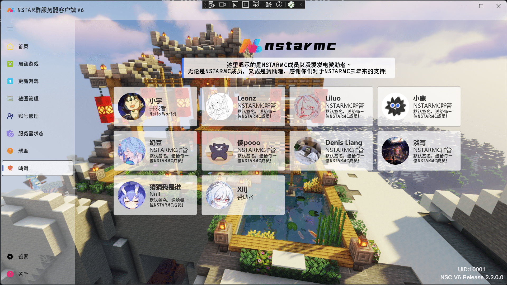
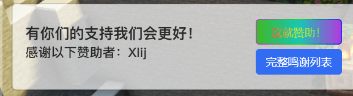
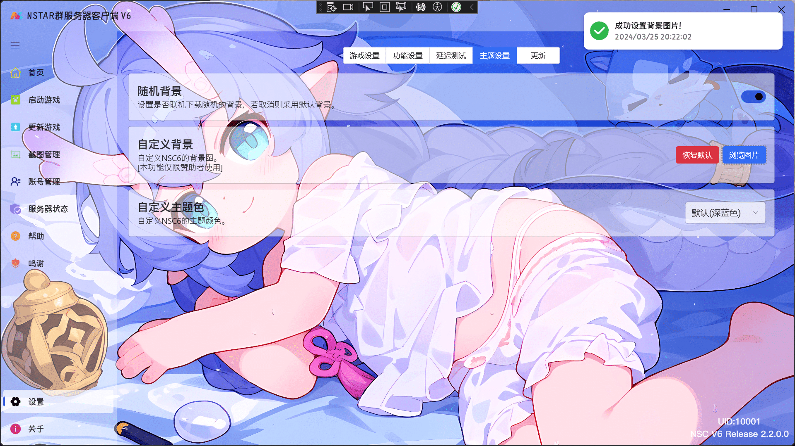
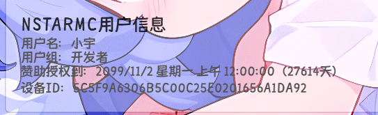
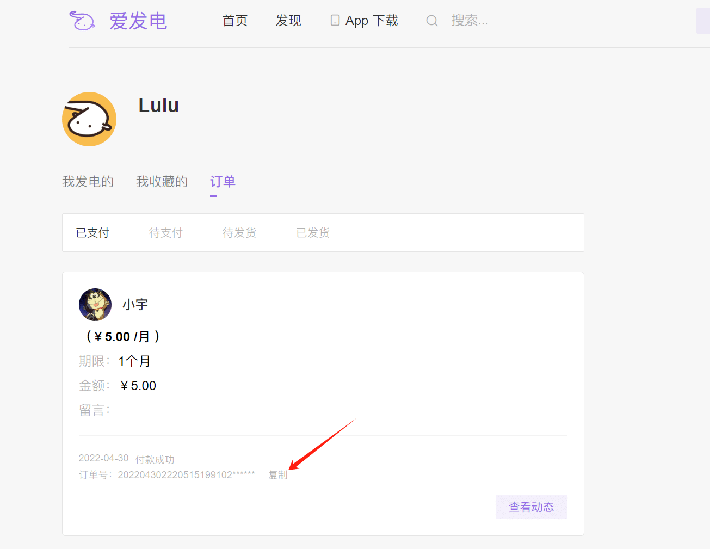
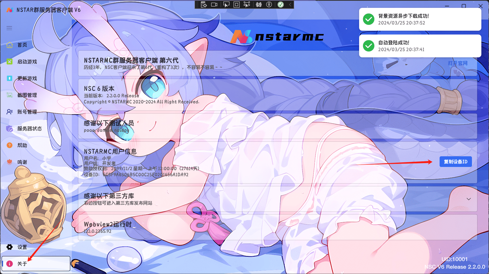

# Q: 赞助后如何绑定到我的账户？
> [!tip]
> 服务器从2020年开始一直都是公益服，仅为让大家在假期一起玩会  
> 所以，赞助不会让你在服务器获得任何物质性内容  
> 对于赞助者，我们仅会列入感谢列表，和提供一些象征性内容  
> 如有能力，欢迎赞助！毕竟开服也是需要资金的~

## 目前赞助会获得的内容

1.显示在服务器客户端的鸣谢页面（当前，赞助任意金额都会被记录在此，若需要自定义签名，需要总赞助金额大于￥20）

TIPS: 只要赞助一次，无论是否过期，您的名字会一直留在这里（除非以后赞助者太多，可能会显示赞助金额更多的用户，但是我觉得不太可能：/）

以及客户端首页也会显示昵称~

2.客户端背景自定义功能（为了让赞助者有更多的自定义体验，所以做了这个）

目前只有那么多，可能也没有更多~

## 有没有什么办法可以获得永久赞助权限？

有的，那就是加入NSTARMC团队

只要你认为你有可以帮上忙的地方，可以来找我哦~

软件开发/MC打包··· 很多都行（群管目前不缺人那倒是）

NSTARMC成员的授权到期时间均为：`2099-11-2` （为什么是11月2号？你猜？）

## 赞助后如何才能获得上述内容？

### 绑定QQ

由于我们无法从爱发电账户猜到你的qq和你的服务器账户，你需要进行一次绑定

目前使用QQ群的方式进行绑定

首先，进入爱发电订单页面：[https://afdian.net/dashboard/order](https://afdian.net/dashboard/order)

然后，找到你赞助的订单，复制订单号

然后在NSTARMC#1/#2群发送信息：`#激活订单 + 订单号`，如：`#激活订单202204302220515199102******`

若机器人返回激活成功，那么就成功绑定到您的qq了

TIPS: 无需担心订单号被群内其他人使用，当你激活后，订单将被标记为已使用

此时，NSTARMC群服务器客户端将会在鸣谢名单中展示您的信息

### 绑定设备

如需要使用NSTARMC服务器客户端的一些仅限赞助者使用的自定义功能，您需要绑定您的设备

也就是说，一个QQ同时只能绑定一台设备（应该没人会分身术吧：？）

首先，进入NSTARMC群服务器客户端（V2.2+版本）（客户端都是强制更新的，说这个好像没啥用），进入关于选项卡，即可复制您的设备ID（设备ID基于Windows SID进行不可逆加密生成，不会泄露您任何信息）

然后在群里发`#绑定设备+设备ID`，绑定成功后，重启客户端即可自动激活

另外，若您更换了系统用户/重装系统，会导致设备ID变化，那么重新绑定即可，并没有限制绑定次数~

> [!tip]
> 赞助权限是按照激活订单的日期开始计算的哦~
> 订单激活后将立即延长您的赞助权限  

## 绑定设备后没有激活？

那只有一种情况，您在注册服务器账户时，没有按照规定使用纯数字的QQ邮箱，导致无法搜到你的账户

这种情况你需要绑定你的服务器账户邮箱，在群里发`#更换邮箱+你的服务器账户邮箱地址`（或者，去把你的服务器账户邮箱改成纯数字QQ邮箱那更好）
> [!warning]
> 赞助账户的邮箱每人只允许修改一次！

## 如何修改鸣谢列表中我的展示信息？

以下指令均在QQ群中使用！

更换昵称（昵称默认采用您的爱发电用户昵称）：`#更换昵称+你的新昵称`

更换签名（默认没有，需要赞助20以上才能加和修改，不能超过20字）：`#更换签名+你的签名`

头像使用的是您的QQ头像，且不支持修改！