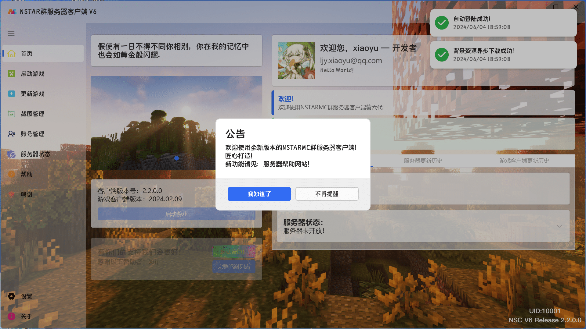
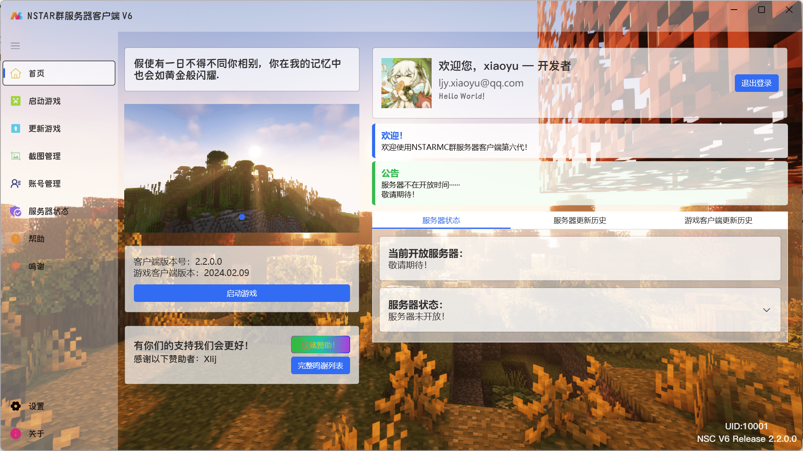
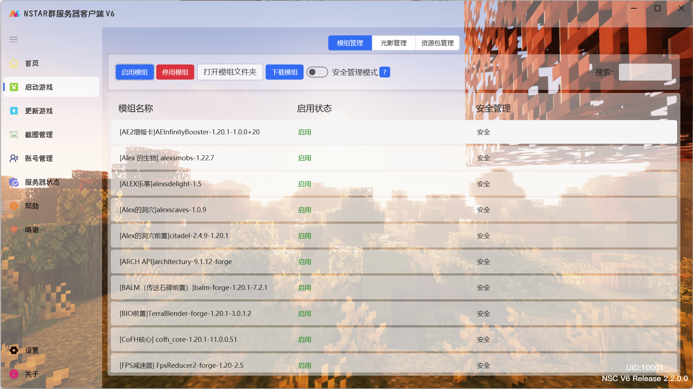
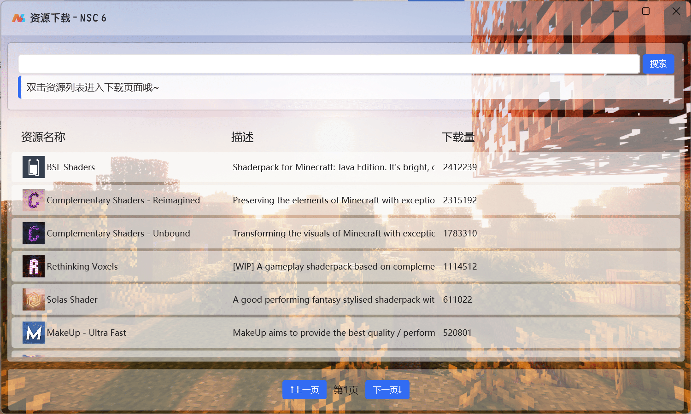
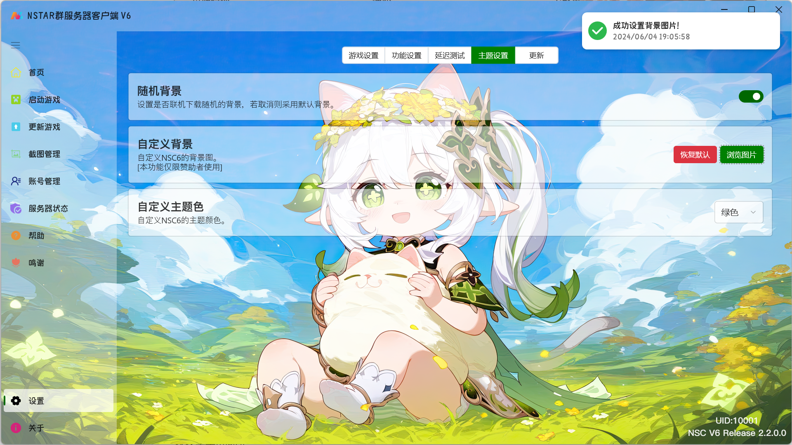
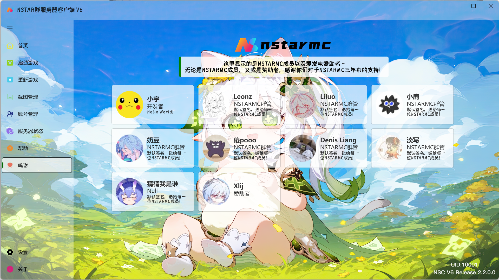
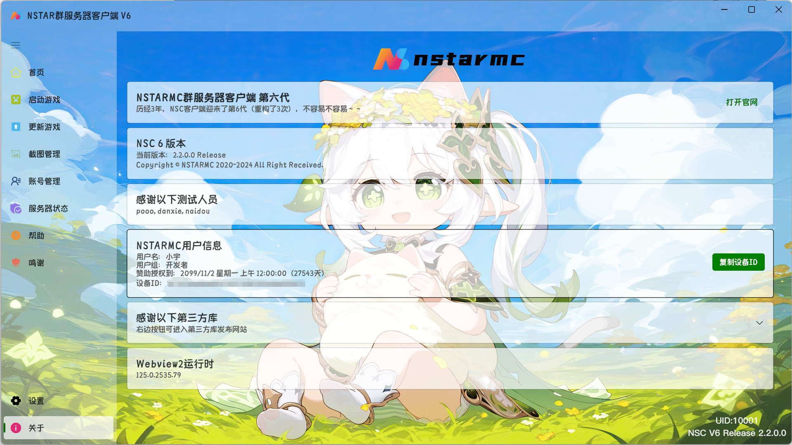

# 🎉V2.2

## 部分功能更新介绍

新增：好看的弹窗风格

主页的公告，个人信息卡片进行部分重做

新增：模组，光影，资源包管理

新增：模组，光影，资源包下载支持（Modrinth）（会直接下载到该版本）

接入新版本授权系统，赞助者/NSTARMC成员有更多自定义主题的选择

新增：鸣谢页面

调整关于页面UI设计

## 完整更新日志

-合并客户端更新日志接口
-新增弹窗公告
-新增客户端更新内容弹窗
-添加Webview2环境安装引导
-优化提示窗
-在资源加载失败时不允许启动
-校验适配后端Sign验证接口
-优化关于页面UI
-支持并发加载资源的版本列表
-支持模组下载
-完成资源下载页面（支持从Modrinth下载光影和资源包）
-完成版本资源管理（模组+光影+资源包）
-若有自定义背景，更早加载
-首页赞助者显示接入新api
-调整游戏需要更新时的UI显示
-添加赞助者激活引导与首页信息显示
-接入新版用户（赞助者）自动授权系统
-添加主题色修改功能
-添加鸣谢页面（NSTARMC团队成员+赞助者）
-一些ui优化
-全新提示窗
-全新公告面板
-更新版本的更新日志从新的接口获取
-修复首页服务器日志无法滑动的bug
-允许自定义客户端背景图（仅赞助者）
-首页轮播图片支持动态多图
-谢谢naidou（对于2024年1月初的协助bugfix）